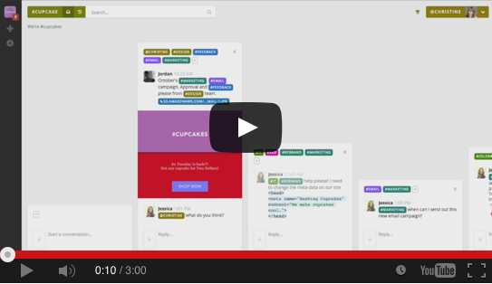

# Braid   

Braid is a **group chat application** that promotes *productive* team communication, while still respecting each individual's need for focus.

Instead of chatrooms, Braid takes a new approach: discrete conversations and tags.

Braid's design fosters conversations that stay on topic and allows for deep integrations with other services (think "1:1 sync", not just "chat bots").

Our goal is to develop Braid into an *open* platform that unites all of a group's communication streams.

If you work in a remote and distributed team...

If you hate the idea of open-offices...

If you get annoyed by when your flow is disrupted...

If you want to stay in sync with your team, but still get things done...

...you'll love Braid.

## Motivation

### Chat-rooms Considered Harmful

Most existing group-chat apps are based on the concept of "rooms" or "channels". Each room consists of a stream of messages, and each group typically has multiple active rooms. The general approach hasn't changed much since it's [inception in the early 70s](https://en.wikipedia.org/wiki/Chat_room).

Over the last few years, products like HipChat and Slack have brought chat-rooms into our offices, with claims of *"finally killing the scourge that is email!"*, or *"being less busy"*, but as [many](https://m.signalvnoise.com/is-group-chat-making-you-sweat-744659addf7d#.r6gxj6zae) [have](http://www.vocativ.com/320111/slack-backlash/) [pointed](https://medium.com/better-people/slack-i-m-breaking-up-with-you-54600ace03ea#.d72qcvqqg) [out](http://motherboard.vice.com/read/were-taking-a-break-from-slack-heres-why), the situation has become worse, not better:

  - chatrooms require constant checking (or else you'll miss your chance to contribute to a conversation)
  - anyone can demand your attention at any time
  - conversations frequently devolve or get off-topic
  - it's difficult to find past conversations in a stream of interwoven chatter
  - [...and much, much, more](./docs/background/chatrooms-considered-harmful.md)

<table>
  <tr>
    <td>
      <blockquote>
        

          Following group chat all day feels like being in an all-day meeting with random participants and no agenda
        

        <footer>
          –
          <cite>
            <a href="https://m.signalvnoise.com/is-group-chat-making-you-sweat-744659addf7d#.r6gxj6zae">
              Jason Fried
            </a>
          </cite>
        </footer>
      </blockquote>
    </td>
    <td>
      <blockquote>
        

          Reading the firehose of team chat is, categorically, not work, but it certainly *feels* like it
        

        <footer>
          –
          <cite>
            <a href="https://twitter.com/Shpigford/status/702871877442793472?ref_src=twsrc%5Etfw">
              Josh Pigford
            </a>
          </cite>
        </footer>
      </blockquote>
    </td>
    <td>
      <blockquote>
        

          Just because it’s fun to hang out at the water cooler at work, it doesn’t mean I want to work there.
        

        <footer>
          –
          <cite>
            <a href="https://medium.com/better-people/slack-i-m-breaking-up-with-you-54600ace03ea#.iu832xu1g">
              Samuel Hulick
            </a>
          </cite>
        </footer>
      </blockquote>
   </td>
  </tr>
</table>

### Beyond Chatrooms & Towards Productive Group Communication

Several factors converge to make chat-rooms bad at fostering productive group communication (you can read [our thoughts on the matter](./docs/background/chat-rooms-considered-harmful.md)), but, at its core, it comes down to chat-rooms being single-threaded: each room is a linear stream of messages. The "flat vs threaded" debate is an old one, and, unfortunately, the other end of the spectrum – full threading – [has it's own set of problems](https://blog.codinghorror.com/web-discussions-flat-by-design/). But perhaps we can find a happy middle...

Braid started out as a weekend experiment: what if, instead of multiple rooms, you had *one* place where you can have *many* *short* conversations?

...each conversation would stick around only for as long as it was relevant, and could be tagged to direct it to the appropriate recipients (and to help with future retrieval). We made [a quick proof-of-concept](https://www.youtube.com/watch?v=pa2bUsChFqM), and quickly realized that we were on to something.

Braid has evolved quite a bit since then, so here's how it looks now:

You may be thinking: "Isn't this pretty much like email ...except optionally real-time ...and with integrations ...and with shared tags?"

Well... Yes. Yes it is.

And it's *awesome*.

## Live Demo

[Give Braid a Try](https://braid.chat/group/try)

## Features

Braid has most of the features you'd expect from other chat clients and new ones are added every week.

### Already Available:

 - archives + search
 - drag and drop file sharing
 - desktop and mobile apps
 - private conversations
 - notifications
 - email digests
 - rich text formatting and emoji
 - integrations support
 - ...and more

### What We're Working On

 - federation and E2E encryption via [Matrix](http://matrix.org/)
 - group audio/video/screen streaming
 - moderation tools
 - better inbox filtering
 - better search
 - decreasing resource usage
 - polishing the UX
 - improving the mobile apps

Question, bugs, and feature requests are tracked at https://github.com/braidchat/braid/issues

A full backlog of features is tracked at https://github.com/braidchat/planning/issues

## Contributing

There are many ways to be involved, from coding new features to helping write user guides. See our [Contributing Guide](./docs/contributing.md) for more details.

Thank you to [all of our contributors](./CONTRIBUTORS.edn)!

## Getting Started

To get Braid working locally, see: [Developing Braid](./docs/dev/how-to/getting-up-and-running-in-development.md)

If you want to deploy it in production, see [Deploying Braid](./docs/dev/how-to/deploying-to-production.md)

If you just want to use Braid, but not set it up yourself, you can get a hosted account at: https://www.braidchat.com

## Repositories

- **[The Primary Repo](https://github.com/braidchat/braid)**

  https://github.com/braidchat/braid

  API server, desktop web client, mobile web client, docs

- **[Native Desktop Client](https://github.com/braidchat/electron)**

  https://github.com/braidchat/electron

  An [Electron](http://electron.atom.io/) app that wraps the desktop web client

- **[Native Mobile Client](https://github.com/braidchat/electron)**

  https://github.com/braidchat/cordova

  A [Cordova](https://cordova.apache.org/) app that wraps the mobile web client

- **[Other Repos](https://github.com/braidchat)**

  https://github.com/braidchat

  Other repos, including sample bots, marketing materials, and miscellany.

## Support

If you run into any problems, please let us know.

Join us on Braid: [braid @ Braid](https://braid.chat/group/braid)

Or, if you must, on Slack: [#braid-chat @ Clojurians](https://clojurians.herokuapp.com/)

## License

Braid may be freely used under the [AGPL license](https://www.gnu.org/licenses/agpl-3.0.html) or you may purchase a commercial license by contacting licensing@braidchat.com.
