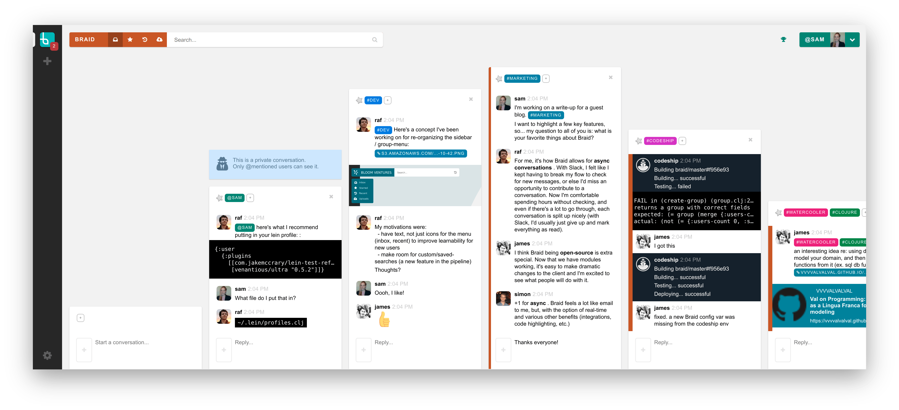

# Braid   

Braid is an experimental **team chat application** with a novel UI: instead of chatrooms, it's based on many short conversations. You can think of Braid as an email/mailing-list/web-forum/chatroom hybrid, but without the constant interruptions and FOMO of Slack. It's particularly good for remote-first companies, developer teams and online communities. Braid is also open-source, so you can hack on it and host your own version.

You can [read more about Braid](https://www.braidchat.com) and then [give Braid a try](https://braid.chat/try).

If you'd like to use Braid with your team, but it's missing a certain something, let us know and we'll try to make it happen.
If you'd like to contribute, even if you're not experienced with Clojure(script), we're available to pair remotely and help you get your first PR started.

- Raf (raf@braidchat.com) & James (james@braidchat.com)

Braid's not as polished as Slack yet, but it's got most of the features you'd expect from other chat clients:

 - public and private conversations
 - archives + search
 - file sharing
 - notifications
 - email digests
 - code formatting and emoji
 - integrations support

It's been our daily driver for over a year, but there are still some rough edges and things we want to improve; notably:

 - better mobile apps
 - better 1:1 integrations
 - polishing non-critical UI (ex. settings)
 - moderation tools
 - and more...

## Contributing

1. **If you like the concept, please let us know!**

   Your feedback is the fuel that pushes us too keep working on Braid. Say hello on [braid@braid](https://braid.chat/braid), and let us know what you think.

2. **Try Braid out on your team/group and give us feedback.**

   You can set up a free team on [braid.chat](https://braid.chat/gateway/create-group) and message us on [braid@braid](https://braid.chat/braid) to give feedback.

3. **If you want to code...**

   Check out the Getting Started instructions below. @rafd and @jamesnvc are available to pair remotely if you'd like help getting started. Message us on [braid@braid](https://braid.chat/braid) and we can help match you with a good task and debug any issues you run into.

There's also opportunities to help with triaging issues, writing docs and other non-"dev" work.

Bugs and feature requests are tracked via [Github Issues](https://github.com/braidchat/braid/issues)

Thank you to [all of our contributors](./CONTRIBUTORS.edn)!

## Getting Started

To get Braid working locally, see: [Developing Braid](./docs/dev/getting-up-and-running-in-development.md)

If you want to deploy it in production, see [Deploying Braid](./docs/on-prem/installing-on-prem.md)

If you just want to use Braid, but not set it up yourself, you can get a hosted account at: https://www.braidchat.com

## Repositories

- **[The Primary Repo](https://github.com/braidchat/braid)**

  https://github.com/braidchat/braid

  API server, desktop web client, mobile web client, docs

- **[Native Desktop Client](https://github.com/braidchat/electron)**

  https://github.com/braidchat/electron

  An [Electron](http://electron.atom.io/) app that wraps the desktop web client

- **[Native Mobile Client](https://github.com/braidchat/electron)**

  https://github.com/braidchat/cordova

  A [Cordova](https://cordova.apache.org/) app that wraps the mobile web client

- **[Other Repos](https://github.com/braidchat)**

  https://github.com/braidchat

  Other repos, including sample bots, marketing materials, and miscellany.

## License

Braid may be freely used under the [AGPL license](https://www.gnu.org/licenses/agpl-3.0.html).

As per the AGPL, you can use Braid for personal or commercial purposes for free, but, you must publically release any modifications to the software (under the same license). If you need to make private modifications you can purchase a commercial license by contacting licensing@braidchat.com
